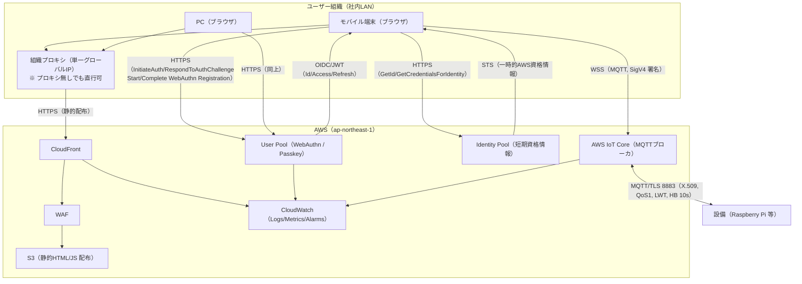
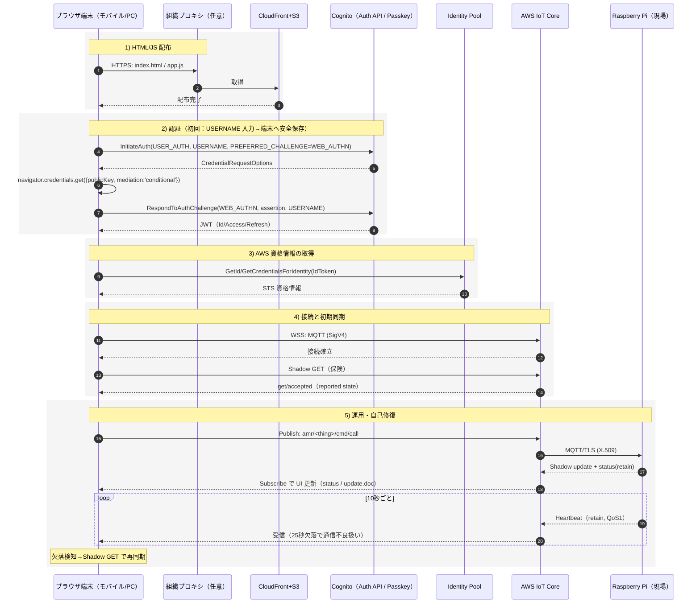
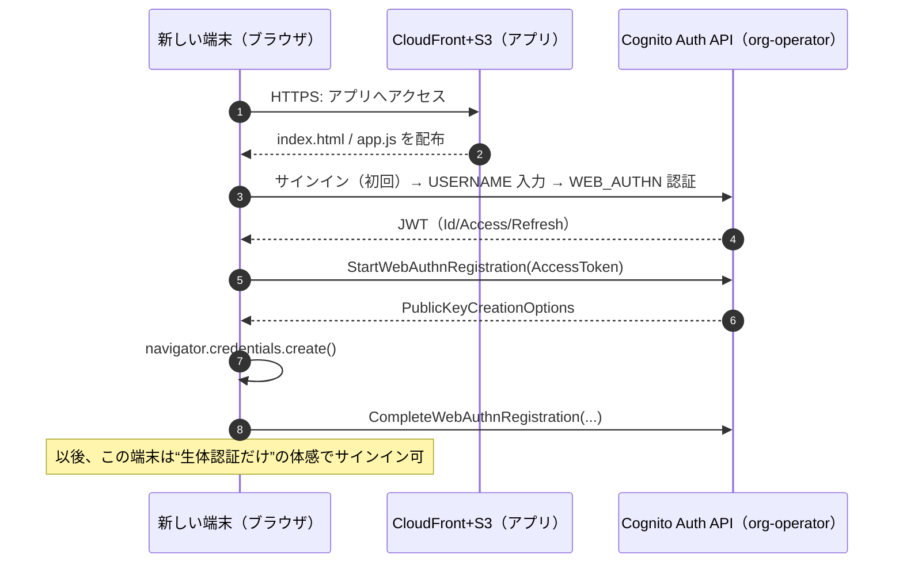
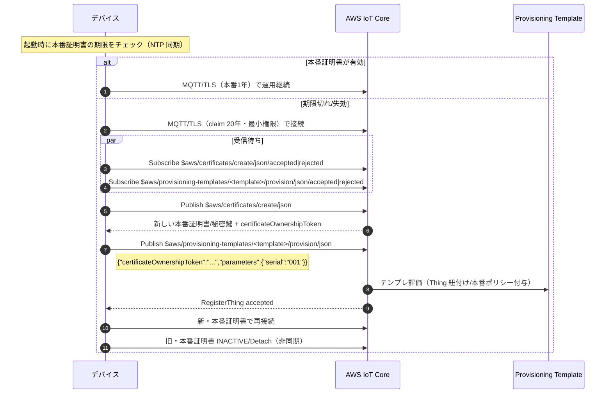
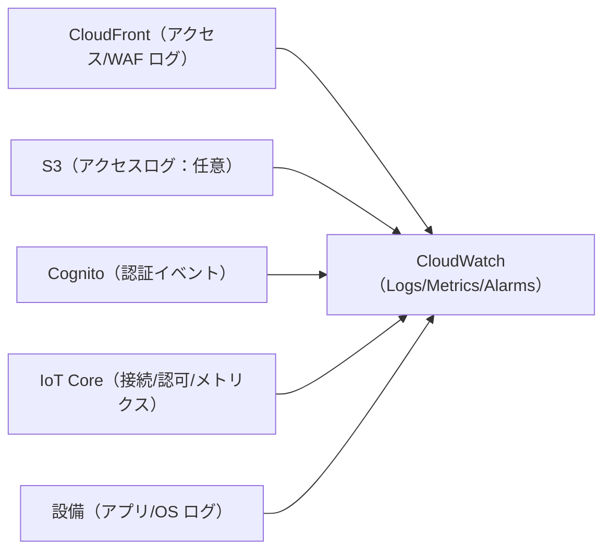

# Iot-gateway-net README（v6 / カスタムUI完全版 / 2025-08）

> 本書は **CloudFront + WAF + S3（静的配信）** の Web アプリ（**カスタムUI**）から **Cognito（ユーザープール + ID プール）** と **AWS IoT Core** を直接呼び出し、**Fleet Provisioning by claim** で設備（例：AMR）をオンボード/運用するための**最終設計**です。Hosted UI は使わず、**WebAuthn（パスキー）を Cognito Auth API で直接呼び出す方式**に統一しました。既存 README（Hosted UI 前提）の全内容を棚卸しし、**欠落していたセクションもすべて復元**のうえ、カスタムUI仕様に適合させています。

---

## 目次

1. スコープと用語
2. 全体アーキテクチャ（図）

   * 2.1 ネットワーク構成図（カスタムUI）
   * 2.2 シーケンス：配布／認証（初回/以降）／運用／自己修復
   * 2.3 シーケンス：UI 端末追加（共有ユーザーへのパスキー登録・カスタムUI版）
   * 2.4 シーケンス：証明書ローテーション（Fleet Provisioning by claim）
   * 2.5 ログ/監視構成図
3. アーキテクチャ要件（コード非依存）

   * 3.1 アイデンティティと認証（カスタムUI / USER\_AUTH / WEB\_AUTHN）
   * 3.2 ネットワークとアクセス制御（CloudFront/WAF/S3/OAC, IoT WSS）
   * 3.3 デバイス証明書と鍵管理（1年/20年, NTP, SE/TPM）
   * 3.4 メッセージ設計（MQTT/Shadow/ハートビート）
4. ポリシー雛形（最小権限）

   * 4.1 Identity Pool 認証ロール（ブラウザ）
   * 4.2 設備（本番）IoT ポリシー
   * 4.3 設備（ブートストラップ/claim）IoT ポリシー（更新専用）
   * 4.4 CSP の例（CloudFront で適用）
5. セキュリティ要件・脆弱性評価（表つき）
6. インテグレータとユーザーの作業分担
7. 運用手順とランブック（端末追加/抹消, 鍵漏洩対応, 更新失敗, DoS 兆候）
8. テスト計画
9. 東京リージョンの月額料金試算（表・前提付き）
10. サンプルコード固有の要件（分離セクション）
11. ディレクトリ構成（本 README が唯一の正）
12. 付録：OpenSSL 例 / 用語集
13. ライセンス

---

## 1. スコープと用語

* 想定リージョン：**東京（ap-northeast-1）**
* 共有アカウント：**Cognito User Pool の単一ユーザー `org-operator`**（複数端末に**パスキー**を登録）
* ブラウザ：**SigV4 署名の WSS（MQTT）で IoT Core に直結**（ID プールの認証ロールで最小権限）
* 設備：**MQTT/TLS 1.2+（X.509）**。**本番 X.509（1年）** と **ブートストラップ X.509（20年・更新専用）** の二段構成

---

## 2. 全体アーキテクチャ（図）

### 2.1 ネットワーク構成図（カスタムUI）



### 2.2 シーケンス：配布／認証（初回/以降）／運用／自己修復



### 2.3 シーケンス：UI 端末追加（共有ユーザーへのパスキー登録・カスタムUI版）



### 2.4 シーケンス：証明書ローテーション（Fleet Provisioning by claim）



### 2.5 ログ/監視構成図



---

## 3. アーキテクチャ要件（コード非依存）

### 3.1 アイデンティティと認証

* 共有アカウント：`org-operator`（**public client** / Client Secret なし）
* 認証方式：**WebAuthn（パスキー）**。**USER\_AUTH + WEB\_AUTHN** で Initiate/Respond フロー
* RP ID（relying party）：Cognito の**ドメイン**（できればカスタムドメイン）と一致
* トークン保管：`sessionStorage` 推奨（XSS対策で CSP 併用）
* 端末追加：**カスタムUIでのパスキー登録（Start/Complete WebAuthn Registration）**

### 3.2 ネットワークとアクセス制御

* CloudFront + WAF + S3（**Block Public Access + OAC**）
* WAF：組織プロキシIP許可（可能なら）＋マネージドルール＋必要に応じてレート制御
* ブラウザ→IoT Core：**WSS（MQTT・SigV4署名）**
* 設備→IoT Core：**MQTT/TLS 1.2+（X.509）**

### 3.3 デバイス証明書と鍵管理

* 本番証明書：**1年**・自動ローテーション（並行稼働→切替→旧 INACTIVE）
* ブートストラップ（claim）：**20年**・更新専用（CreateKeysAndCertificate / RegisterThing の MQTT トピックのみ許可）
* 秘密鍵保護：**TPM/セキュアエレメント推奨**、少なくとも **端末外に出さない**
* 時刻同期：**NTP 必須**（NotBefore/NotAfter 判定）

### 3.4 メッセージ設計（MQTT/Shadow/ハートビート）

* 呼出し：`amr/AMR-001/cmd/call`（例）
* ステータス：`amr/AMR-001/status`（retain, QoS1）
* Shadow（名前付き例）：`$aws/things/AMR-001/shadow/name/robot/*`
* ハートビート：**10 秒**、**25 秒欠落**で UI 側が再同期（Shadow GET）

---

## 4. ポリシー雛形（最小権限）

### 4.1 Identity Pool 認証ロール（ブラウザ）

```json
{
  "Version": "2012-10-17",
  "Statement": [
    {
      "Effect": "Allow",
      "Action": ["iot:Connect"],
      "Resource": ["arn:aws:iot:ap-northeast-1:ACCOUNT_ID:client/${cognito-identity.amazonaws.com:sub}-*"],
      "Condition": {"StringLike": {"iot:ClientId": "${cognito-identity.amazonaws.com:sub}-*"}}
    },
    {
      "Effect": "Allow",
      "Action": ["iot:Subscribe"],
      "Resource": [
        "arn:aws:iot:ap-northeast-1:ACCOUNT_ID:topicfilter/amr/AMR-001/*",
        "arn:aws:iot:ap-northeast-1:ACCOUNT_ID:topicfilter/$aws/things/AMR-001/*"
      ]
    },
    {
      "Effect": "Allow",
      "Action": ["iot:Publish", "iot:Receive"],
      "Resource": [
        "arn:aws:iot:ap-northeast-1:ACCOUNT_ID:topic/amr/AMR-001/*",
        "arn:aws:iot:ap-northeast-1:ACCOUNT_ID:topic/$aws/things/AMR-001/*"
      ]
    }
  ]
}
```

### 4.2 設備（本番）IoT ポリシー

```json
{
  "Version": "2012-10-17",
  "Statement": [
    {
      "Effect": "Allow",
      "Action": ["iot:Connect"],
      "Resource": ["arn:aws:iot:ap-northeast-1:ACCOUNT_ID:client/${iot:Connection.Thing.ThingName}"],
      "Condition": {"Bool": {"iot:Connection.Thing.IsAttached": "true"}}
    },
    {
      "Effect": "Allow",
      "Action": ["iot:Publish", "iot:Receive"],
      "Resource": [
        "arn:aws:iot:ap-northeast-1:ACCOUNT_ID:topic/amr/${iot:Connection.Thing.ThingName}/*",
        "arn:aws:iot:ap-northeast-1:ACCOUNT_ID:topic/$aws/things/${iot:Connection.Thing.ThingName}/*"
      ]
    },
    {
      "Effect": "Allow",
      "Action": ["iot:Subscribe"],
      "Resource": [
        "arn:aws:iot:ap-northeast-1:ACCOUNT_ID:topicfilter/amr/${iot:Connection.Thing.ThingName}/*",
        "arn:aws:iot:ap-northeast-1:ACCOUNT_ID:topicfilter/$aws/things/${iot:Connection.Thing.ThingName}/*"
      ]
    }
  ]
}
```

### 4.3 設備（ブートストラップ/claim）IoT ポリシー（更新専用）

> **API アクション（`iot:CreateKeysAndCertificate` 等）は付与しません。** 代わりに **MQTT の AWS IoT 専用トピック**（`$aws/certificates/create/json`、`$aws/provisioning-templates/<template>/provision/json` 等）へ Publish/Subscribe/Receive します。

```json
{
  "Version": "2012-10-17",
  "Statement": [
    { "Effect": "Allow", "Action": ["iot:Connect"], "Resource": ["*"] },
    {
      "Effect": "Allow",
      "Action": ["iot:Publish", "iot:Receive"],
      "Resource": [
        "arn:aws:iot:ap-northeast-1:ACCOUNT_ID:topic/$aws/certificates/create/json",
        "arn:aws:iot:ap-northeast-1:ACCOUNT_ID:topic/$aws/certificates/create/json/accepted",
        "arn:aws:iot:ap-northeast-1:ACCOUNT_ID:topic/$aws/certificates/create/json/rejected",
        "arn:aws:iot:ap-northeast-1:ACCOUNT_ID:topic/$aws/provisioning-templates/YOUR_TEMPLATE/provision/json",
        "arn:aws:iot:ap-northeast-1:ACCOUNT_ID:topic/$aws/provisioning-templates/YOUR_TEMPLATE/provision/json/accepted",
        "arn:aws:iot:ap-northeast-1:ACCOUNT_ID:topic/$aws/provisioning-templates/YOUR_TEMPLATE/provision/json/rejected"
      ]
    },
    {
      "Effect": "Allow",
      "Action": ["iot:Subscribe"],
      "Resource": [
        "arn:aws:iot:ap-northeast-1:ACCOUNT_ID:topicfilter/$aws/certificates/create/json",
        "arn:aws:iot:ap-northeast-1:ACCOUNT_ID:topicfilter/$aws/certificates/create/json/*",
        "arn:aws:iot:ap-northeast-1:ACCOUNT_ID:topicfilter/$aws/provisioning-templates/YOUR_TEMPLATE/provision/json",
        "arn:aws:iot:ap-northeast-1:ACCOUNT_ID:topicfilter/$aws/provisioning-templates/YOUR_TEMPLATE/provision/json/*"
      ]
    }
  ]
}
```

### 4.4 CSP の例（CloudFront で適用）

```
Content-Security-Policy:
  default-src 'self';
  script-src 'self' https://cdn.example.com 'sha256-...';  # SRI 併用（値は実ファイルに合わせる）
  connect-src 'self' https://cognito-idp.ap-northeast-1.amazonaws.com https://cognito-identity.ap-northeast-1.amazonaws.com wss://*.iot.ap-northeast-1.amazonaws.com;
  frame-ancestors 'none';
  object-src 'none';
```

---

## 5. セキュリティ要件・脆弱性評価（表）

### 脆弱性一覧（例）

| No | 項目              | 想定脆弱性                 | リスク | 主要対策                                        |
| -: | --------------- | --------------------- | :-: | ------------------------------------------- |
|  1 | 共有アカウント         | 端末紛失時の不正利用            |  高  | Passkey 必須・WAF IP 制限・パスキー棚卸し/無効化 UI・短いセッション |
|  2 | フロント公開値         | `config.js` 識別子のコピー悪用 |  低  | 認証必須、IAM 最小権限、CSP/CORS                      |
|  3 | WSS/MQTT への DoS | 過剰接続・再試行              |  中  | バックオフ/再接続制御、メトリクス監視、（必要時）WAF 側で抑制           |
|  4 | 証明書期限           | 期限切れで不通               |  中  | 自動ローテーション、二重期間、期限逼迫アラート、NTP                 |
|  5 | ログ不足            | 侵害の検知遅延               |  中  | 各サービスのログ集約、失敗イベントのアラート、保持期間の規定              |
|  6 | 供給網             | 外部 JS の置換/XSS         |  中  | バージョン固定、SRI、厳格 CSP、自己ホスト検討                  |

**必須セキュリティコントロール（抜粋）**：public client、Redirect URI（または RP ドメイン）厳格化、`iot:Connect` を clientId で制限、Thing/トピック縛り、S3 OAC、失敗系の検知・期限逼迫監視。

---

## 6. インテグレータとユーザーの作業分担

**インテグレータ（SIer）**

1. Cognito：User Pool（パスキー有効化、RP 設定）、アプリクライアント（public client）、ID プール連携
2. IoT Core：Thing 作成、Fleet Provisioning テンプレート、claim（更新専用）/本番ポリシー
3. フロント：S3（Public Block + OAC）、CloudFront、WAF、CSP
4. 監視：CloudWatch（Logs/Metrics/Alarms）
5. claim 証明書：20 年自己署名、ポリシー付与、端末への安全配布

**ユーザー組織（運用者）**

* CloudFront の URL へアクセスし、初回サインインで端末へパスキー登録
* 紛失・退役端末のパスキー削除（棚卸し）
* 設備の更新失敗・鍵漏洩時のランブックに従い対応

---

## 7. 運用手順とランブック

### 端末（UI）の追加

1. 新端末で CloudFront URL へアクセス
2. 初回のみ **USERNAME 入力 → WEB\_AUTHN サインイン → Start/Complete Registration でパスキー登録**
3. 以後は生体認証のみでサインイン（保存済み USERNAME を自動投入）

### 端末（UI）の抹消

1. アプリのアカウント設定画面で **登録済みパスキー一覧** を表示
2. 紛失・退役端末のエントリを **削除**（当該端末は以後サインイン不可）

### 鍵漏洩（設備）時の対応

1. 影響範囲を特定（証明書ID・Thing）
2. 当該証明書を **INACTIVE/REVOKED**、IoT ポリシーを **デタッチ**
3. 端末をリブート → claim 証明書で更新フロー → 新本番証明書に切替
4. CloudWatch で失敗イベント／再接続を監視

### 証明書更新失敗時

1. 旧本番証明書で接続できる間に再試行（並行稼働期間中）
2. 旧本番も不可なら **claim（20年）で更新**
3. それでも不可ならネットワーク・NTP・テンプレート設定を確認

### DoS 兆候・異常トラフィック

1. CloudFront/WAF のルール/レート制御の閾値を一時的に強化
2. CloudFront ログでペイロード元を特定
3. 影響度に応じて一時ブロック・ルール追加

---

## 8. テスト計画

* WebAuthn：主要ブラウザ/OS 組み合わせで登録/サインイン（Conditional UI 動作）
* IAM/IoTPolicy：許容・拒否パス（他 Thing へのアクセス拒否、clientId 不一致の拒否）
* 自動ローテーション：短期証明書での切替試験（再接続で有効性検証）
* 長期休眠：期限切れ後の起動→claim で復旧
* HB 欠落：ネットワーク遮断で 25 秒後の「通信不良」表示と再同期
* 鍵漏洩試験：複製接続、証明書 INACTIVE、ポリシーデタッチの挙動

---

## 9. 東京リージョンの月額料金試算（概算）

> 価格は将来変わり得ます。以下は規模感の比較に用いる**概算**です。

| 規模  | CloudFront |        S3（転送） |  WAF |  Cognito |        IoT Core |    CloudWatch |             合計感 |
| --- | ---------: | ------------: | ---: | -------: | --------------: | ------------: | --------------: |
| 小規模 |        \$5 | \$18（\~200GB） | \$10 |      \$5 | \$10（\~200万件/月） |  \$10（\~20GB） | **\$60～\$70/月** |
| 大規模 |        \$5 |    \$114（1TB） | \$30 | \$5～\$20 |  \$100（\~1億件/月） | \$50（\~100GB） |     **\$300前後** |

※ IoT Core は 5KB 単位課金で、メッセージ数とサイズに強く依存。CloudFront は地域別単価・ティアで変動。S3 リクエスト課金は少額のため概算に含めつつ丸めています。

---

## 10. サンプルコード固有の要件（分離セクション）

> ここは**参考実装**の条件であり、アーキテクチャ要件とは分離しています。詳細は `sample/README.md` を参照してください。

* サーバ機（Raspberry Pi）実装：Python+paho-mqtt、ハートビート/Shadow 更新、LWT
* フロント（S3/CloudFront）実装：HTML+JS（ESM任意）、外部ライブラリはバージョン固定+SRI
* `config.js` は公開識別子のみ（region, userPoolId, appClientId, identityPoolId, iotEndpoint）

---

## 11. ディレクトリ構成（本 README が唯一の正）

```
Iot-gateway-net/
├─ README.md                 # 本書（アーキテクチャの単一の正）
├─ AWS_Console_Setup_Manual.md   # インテグレータ向け AWS 設定手順書
├─ sample/                   # サンプル一式
│  ├─ README.md              # サンプル実行手順（S3 + Thing）
│  ├─ s3/                    # ブラウザ配布物（S3/CloudFront）
│  │  ├─ index.html
│  │  ├─ app.js
│  │  └─ config.js
│  └─ thing/                 # 設備側（Raspberry Pi, Python）
│     ├─ server.py
│     ├─ requirements.txt
│     ├─ certs/              # 証明書置き場（git管理しない）
│     │  └─ .gitkeep
│     └─ venv/               # Python仮想環境（git管理しない）
└─ .gitignore
```

---

## 12. 付録

### 12.1 OpenSSL：claim（自己署名 20 年）

```bash
openssl req -x509 -newkey rsa:2048 -nodes \
  -keyout claim.key -out claim.crt \
  -subj "/CN=device-claim" -days 7300
```

* 端末ごとに個別の claim を推奨（漏洩時の影響最小化）
* claim 用ポリシーは **更新専用トピックのみ** 許可

### 12.2 用語集（要点）

* **claim 証明書**：更新専用の長期証明書。`$aws/certificates/create/json` と `$aws/provisioning-templates/<template>/provision/json` を使用
* **Role alias**：IoT Core が参照する IAM ロールのエイリアス。テンプレートから利用
* **Conditional UI**：ブラウザがパスキーの候補を自動サジェストし、**テキスト入力なしに近い体験**を実現する UI モード

---

## 13. ライセンス

本ドキュメントおよび同梱サンプルは学習・検証目的の参考実装です。商用導入時は、貴社のセキュリティ基準・監査要件・SLA に沿って適切な審査・強化を行ってください。
