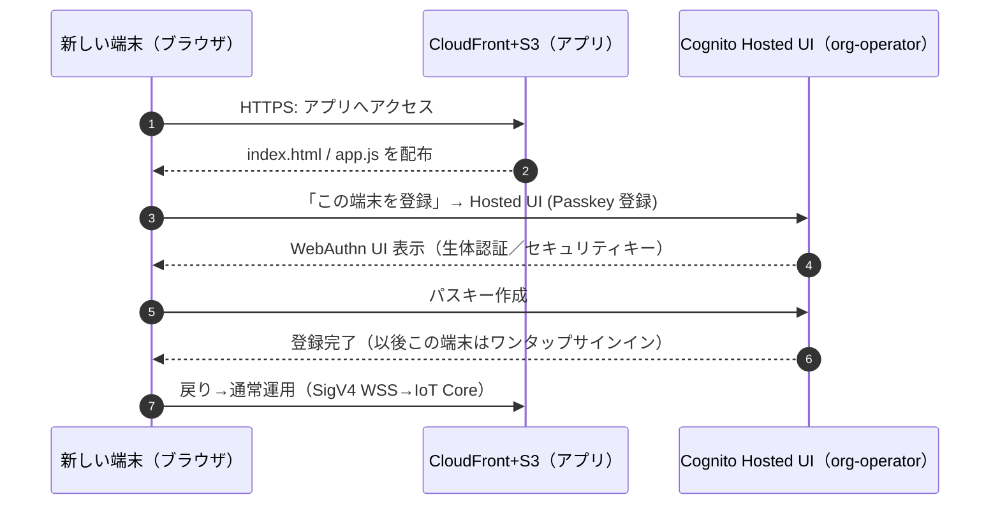
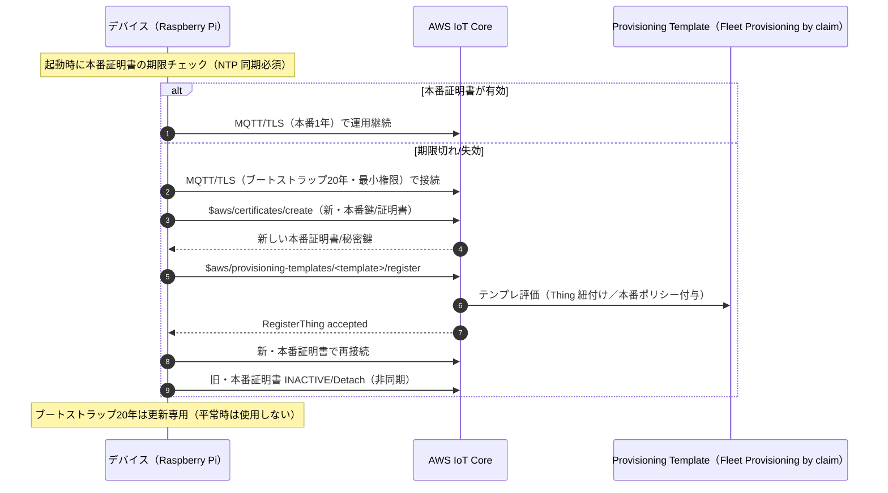
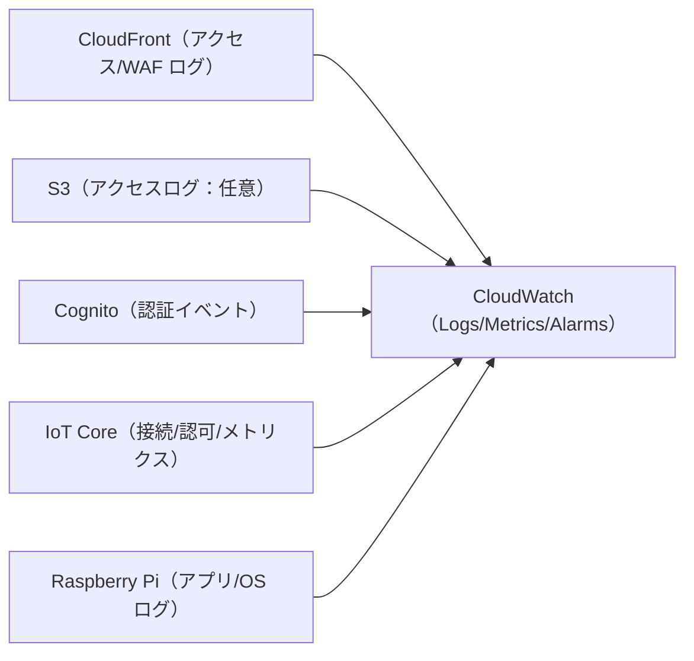

# Iot-gateway-net
AWS IoT Core を中心に **「ユーザー組織から安全に設備（例：AMR）を操作・監視する」** ためのネットワーク／セキュリティ設計ドキュメントです。  
本書は **アーキテクチャ要件** を主題にしつつ、参考として **サンプルコード固有の要件** を分離して付記します。  
運用形態は **共有アカウント方式**（Cognito の単一ユーザー `org-operator` に複数端末のパスキーを登録）を前提とします。

- ブラウザ（モバイル端末／PC）：**Cognito Passkey (WebAuthn) + SigV4 WSS** で IoT Core に接続
- 設備側（Raspberry Pi 等）：**MQTT/TLS（X.509）**
  - 本番証明書：**1年**・自動ローテーション
  - ブートストラップ証明書：**20年**・更新専用（最小権限）

---

## 目次
1. [スコープと用語](#スコープと用語)  
2. [全体アーキテクチャ（図）](#全体アーキテクチャ図)  
   2.1 [ネットワーク構成図](#ネットワーク構成図)  
   2.2 [シーケンス：配布／認証／運用／自己修復](#シーケンス配布認証運用自己修復)  
   2.3 [シーケンス：UI 端末追加（共有ユーザーへのパスキー登録）](#シーケンスui-端末追加共有ユーザーへのパスキー登録)  
   2.4 [シーケンス：証明書ローテーション（本番1年・ブートストラップ20年）](#シーケンス証明書ローテーション本番1年ブートストラップ20年)  
   2.5 [ログ／監視構成図](#ログ監視構成図)  
3. [アーキテクチャ要件（コード非依存）](#アーキテクチャ要件コード非依存)  
   3.1 [アイデンティティと認証](#アイデンティティと認証)  
   3.2 [ネットワークとアクセス制御](#ネットワークとアクセス制御)  
   3.3 [デバイス証明書と鍵管理](#デバイス証明書と鍵管理)  
   3.4 [メッセージ設計（MQTT/Shadow/ハートビート）](#メッセージ設計mqttshadowハートビート)  
   3.5 [監視・運用・アラート](#監視運用アラート)  
4. [セキュリティ要件・脆弱性評価（表）](#セキュリティ要件脆弱性評価表)  
   4.1 [リスク基準](#リスク基準)  
   4.2 [必須セキュリティコントロール](#必須セキュリティコントロール)  
5. [インテグレータとユーザーの作業分担](#インテグレータとユーザーの作業分担)  
   5.1 [インテグレータ（SIer）の作業](#インテグレータsierの作業)  
   5.2 [ユーザー組織：モバイル端末／PC の作業](#ユーザー組織モバイル端末pc-の作業)  
   5.3 [ユーザー組織：サーバ機（現場設備）の作業](#ユーザー組織サーバ機現場設備の作業)  
6. [東京リージョンの月額料金試算（表・前提付き）](#東京リージョンの月額料金試算表前提付き)  
7. [運用手順とランブック](#運用手順とランブック)  
8. [テスト計画](#テスト計画)  
9. [GDPR/プライバシーの考慮](#gdprプライバシーの考慮)  
10. [サンプルコード固有の要件（分離セクション）](#サンプルコード固有の要件分離セクション)  
11. [付録：ポリシー雛形・設定例](#付録ポリシー雛形設定例)  
12. [ディレクトリ構成](#ディレクトリ構成)  
13. [ライセンス](#ライセンス)

---

## スコープと用語
- 本書は **アーキテクチャ設計と運用要件** を主題とします。具体的なアプリコードは参考扱い（第10章）で分離しています。
- 想定リージョン：**東京（ap-northeast-1）**
- 共有アカウント：**Cognito User Pool の単一ユーザー `org-operator`**
- ユーザー組織：モバイル端末／PC と **組織プロキシ（単一グローバルIP）** を含む（プロキシは任意）
- 設備側：**Raspberry Pi**（AMR内サーバ機の代表例）。本番 X.509（1年）＋ブートストラップ X.509（20年・更新専用）

---

## 全体アーキテクチャ（図）

### ネットワーク構成図
```mermaid
flowchart TD
  subgraph UserOrg["ユーザー組織（社内LAN）"]
    Mobile["モバイル端末（ブラウザ）"]
    PC["PC（ブラウザ）"]
    Proxy["組織プロキシ（単一グローバルIP）<br>※ プロキシ未設置でも動作可（注記）"]
    Mobile --> Proxy
    PC --> Proxy
  end

  subgraph AWS["AWS（東京 ap-northeast-1）"]
    S3["Amazon S3（静的HTML/JS 配布）"]
    CF["Amazon CloudFront"]
    WAF["AWS WAF"]
    Cognito["Amazon Cognito（User Pool Passkey / Identity Pool）<br>共有ユーザー：org-operator"]
    IoT["AWS IoT Core（MQTT ブローカ）"]
    CW["Amazon CloudWatch（Logs / Metrics / Alarms）"]
  end

  subgraph Field["現場／オンプレ"]
    RPi["Raspberry Pi（サーバ機）<br>- 本番証明書：1年・自動更新<br>- ブートストラップ証明書：20年・更新専用（最小権限）"]
  end

  %% 組織 → AWS（用途ごとに明記）
  Proxy -- "HTTPS（HTML/JS 配布）" --> CF --> WAF --> S3
  Proxy -- "HTTPS（認証：Hosted UI／Passkey）" --> Cognito
  Proxy -- "WSS（MQTT, SigV4 署名）" --> IoT

  %% 現場設備 ↔ IoT Core
  RPi <-- "MQTT/TLS 8883（X.509, QoS1, LWT, Heartbeat 10s）" --> IoT

  %% 監視
  CF --> CW
  Cognito --> CW
  IoT --> CW
````

**注記**

* 組織プロキシが無い構成でも同一種別の通信で AWS に直行します（図では簡潔化のため省略）。
* HTML/JS と 認証（Hosted UI）は **別ルートの HTTPS** として明記しています。

---

### シーケンス：配布／認証／運用／自己修復

```mermaid
sequenceDiagram
    autonumber
    participant M as ブラウザ端末（モバイル/PC）
    participant P as 組織プロキシ（任意）
    participant CF as CloudFront+S3
    participant Cg as Cognito（Hosted UI / Passkey：org-operator）
    participant IoT as AWS IoT Core
    participant R as Raspberry Pi（現場）

    rect rgb(245,245,245)
      Note over M,P: 1) HTML/JS 配布
      M->>P: HTTPS: index.html / app.js
      P->>CF: 取得
      CF-->>M: 配布完了
    end

    rect rgb(245,245,245)
      Note over M,Cg: 2) 認証（共有ユーザーに端末パスキーを登録済み）
      M->>Cg: HTTPS: Hosted UI へ
      Cg-->>M: ID トークン（public client）
    end

    rect rgb(245,245,245)
      Note over M,IoT: 3) 接続と初期同期
      M->>IoT: WSS: MQTT (SigV4)
      IoT-->>M: 接続確立
      M->>IoT: Shadow GET（保険）
      IoT-->>M: get/accepted（reported state）
    end

    rect rgb(245,245,245)
      Note over M,R: 4) 運用・自己修復
      M->>IoT: Publish: amr/<thing>/cmd/call
      IoT->>R: MQTT/TLS (X.509)
      R-->>IoT: Shadow update + status(retain)
      IoT-->>M: Subscribe で UI 更新（status / update.doc）
      loop 10秒ごと
          R-->>IoT: Heartbeat（retain, QoS1）
          IoT-->>M: 受信（25秒欠落で通信不良扱い）
      end
      Note over M: 欠落検知→Shadow GET で再同期
    end
```

---

### シーケンス：UI 端末追加（共有ユーザーへのパスキー登録）



---

### シーケンス：証明書ローテーション（本番1年・ブートストラップ20年）



---

### ログ／監視構成図



* IoT Core は \*\*メッセージ「ペイロード」\*\*を自動保存しません（機微情報は載せない設計／必要時は IoT ルール+Lambda で保管）。

---

## アーキテクチャ要件（コード非依存）

### アイデンティティと認証

* **共有アカウント方式**：Cognito User Pool のユーザー `org-operator`
* 認証方式：**Passkey（WebAuthn）**、public client（Client Secret なし）
* Hosted UI：**Redirect URI をホワイトリスト**（コピー悪用を防止）
* UI 端末の追加：**パスキーの追加登録**でセルフエンロール（AWS コンソール不要）
* トークン保管：`sessionStorage` を優先、CSP/CORS を厳格化

### ネットワークとアクセス制御

* CloudFront + WAF + S3（OAC/OAI）で静的配布
* WAF：**組織プロキシのグローバルIP許可**（可能なら）＋レート制限＋マネージドルール
* ブラウザ→IoT Core：**WSS（MQTT・SigV4署名）**
* 設備→IoT Core：**MQTT/TLS 1.2+（X.509）**
* IAM/IotPolicy：**最小権限**（clientId / Thing / topic のスコープ制限）

### デバイス証明書と鍵管理

* 本番証明書：**1年**・自動ローテーション（新旧並行→切替→旧 INACTIVE）
* ブートストラップ証明書：**20年**・更新専用（CreateKeysAndCertificate / RegisterThing のみ許可）
* 秘密鍵保護：**TPM/セキュアエレメント推奨**、少なくとも **端末外に出さない**
* 時刻同期：**NTP 必須**（NotBefore/NotAfter 判定の整合）

### メッセージ設計（MQTT/Shadow/ハートビート）

* 代表例（Thing：`AMR-001`）

  * 呼出し：`amr/AMR-001/cmd/call`
  * ステータス：`amr/AMR-001/status`（retain, QoS1）
  * Shadow（名前付き例）：`$aws/things/AMR-001/shadow/name/robot/*`
* ステート管理：Shadow を権威にし **version 前進のみ採用**。ギャップ検知で Shadow GET 再同期
* **ハートビート 10秒**、25 秒欠落で「通信不良」表示

### 監視・運用・アラート

* CloudWatch Logs/Metrics/Alarms

  * 監視例：IoT 接続/認可失敗、WAF ルールヒット、Cognito 失敗、HB 欠落、証明書期限逼迫
* 監査：証明書 INACTIVE/REVOKED・RegisterThing の操作ログを確認できる体制

---

## セキュリティ要件・脆弱性評価（表）

### 脆弱性一覧

| No | 項目         | 想定脆弱性                        | リスク | 主要対策                                                     |
| -: | ---------- | ---------------------------- | :-: | -------------------------------------------------------- |
|  1 | 共有アカウント    | 端末紛失時の不正利用                   |  高  | Passkey 必須・WAF IP 制限・パスキー棚卸し/無効化 UI・短いセッション              |
|  2 | Hosted UI  | 不正なリダイレクト先の悪用                |  中  | Redirect URI を厳格ホワイトリスト、Client Secret 不使用（public client） |
|  3 | フロント公開値    | `config.js` の識別子のコピー悪用       |  低  | 認証必須、IAM 最小権限（clientId/トピック縛り）、CSP/CORS/WAF              |
|  4 | MQTT 認可    | 他 Thing への Publish/Subscribe |  高  | 「証明書⇔Thing⇔clientId」バインド、トピックを Thing スコープで限定             |
|  5 | 設備秘密鍵      | 秘密鍵流出・複製接続                   |  高  | TPM/SE、鍵の端末外不出、漏洩時 INACTIVE/REVOKED、強制切断                 |
|  6 | ブートストラップ長期 | 20年の長期有効の悪用                  |  高  | 更新専用最小権限、デバイスごと個別証明書、漏洩時即無効化                             |
|  7 | 可用性        | WSS/MQTT への DoS              |  中  | WAF レート制限、バックオフ、再接続制御、メトリクス監視                            |
|  8 | 期限管理       | 証明書期限切れで不通                   |  中  | 自動ローテーション、二重期間、期限逼迫アラート、NTP                              |
|  9 | ログ不足       | 侵害や誤操作の検知遅延                  |  中  | 各サービスのログ集約、失敗イベントのアラート、保持期間の規定                           |
| 10 | 供給網        | 外部 JS の置換/XSS                |  中  | バージョン固定、SRI、厳格 CSP、自己ホスト検討                               |

### リスク基準

* 高：成立で不正操作・設備制御まで到達する恐れが高い
* 中：可用性・運用に影響（検知・復旧で回避可能）
* 低：標準ベストプラクティスで十分に低減できる

### 必須セキュリティコントロール

* Cognito：public client、Redirect URI 固定、パスキー追加・削除 UI
* IAM（Identity Pool 認証ロール）：`iot:Connect` を clientId で制限、Publish/Subscribe/Receive のトピック範囲を限定
* IoT ポリシー（設備）：Thing/トピック縛り。claim 証明書は更新専用トピックのみ
* NW：WAF/IP 許可、CSP/CORS、S3 OAC
* ログ／監視：失敗系の検知・通知、期限逼迫監視

---

## インテグレータとユーザーの作業分担

### インテグレータ（SIer）の作業

1. **Cognito**

   * User Pool 作成、Passkey 有効、Hosted UI ドメイン設定、Redirect URI 登録
   * 共有ユーザー `org-operator` 作成（パスワードレス／Passkeyのみ推奨）
   * Identity Pool 作成、認証ロールに **IoT 最小権限** 付与
2. **IoT Core**

   * Thing（例：AMR-001）作成
   * Fleet Provisioning by claim：テンプレート作成（RegisterThing/AttachPolicy）
   * claim（ブートストラップ）用ポリシー（更新専用）作成
   * 本番用ポリシー（Thing/トピック縛り）作成
3. **フロント（S3/CloudFront/WAF）**

   * S3 に静的サイトを配置（Block Public Access + OAC）
   * CloudFront ディストリビューション作成、WAF 適用、CSP/CORS 設定
4. **監視（CloudWatch）**

   * ログ集約とメトリクス、期限逼迫や失敗イベントのアラーム
5. **ブートストラップ証明書**

   * OpenSSL で 20年の自己署名 claim 証明書を発行
   * ポリシー（更新専用）をアタッチし、端末へ安全に書き込み
6. **運用文書**

   * 端末の追加・棚卸し・抹消手順、鍵漏洩時の対応、更新失敗時の復旧手順

### ユーザー組織：モバイル端末／PC の作業

* CloudFront の URL にアクセス
* 初回のみ Hosted UI で **「この端末を登録」**（パスキー追加）
* 以後はワンタップサインインで呼出し操作可能
* 紛失・退役端末は **登録済みパスキー一覧から削除**

### ユーザー組織：サーバ機（現場設備）の作業

* サーバ機を現場に設置し、ネットワーク接続（NTP 有効）
* 電源投入で自動起動（claim 証明書は出荷時に実装済）
* 本番証明書が有効なら通常運用、期限切れ時は **自動ローテーション** 実行
* 特別な AWS コンソール操作は不要

---

## 東京リージョンの月額料金試算（表・前提付き）

> 価格は変更され得るため**概算**です。実見積りは AWS Pricing Calculator で再確認してください。
> 想定は BtoB 業務 UI（静的サイト）＋ IoT 制御（低頻度メッセージ）です。

### 前提

* CloudFront 転送量：小規模 50GB／月、中規模 200GB／月、大規模 1TB／月
* IoT メッセージ：1 台あたり HB 10秒 + 軽微なイベント。小規模 100 台／中 1,000 台／大 10,000 台
* Cognito MAU：共有ユーザー 1、管理 UI ログインは少数（無料枠内）
* CloudWatch ログ：小 5GB／中 20GB／大 100GB（要調整）

### 概算（ap-northeast-1）

| 規模          | S3（静的） |     CloudFront 転送 |          WAF |   Cognito |   IoT Core（メッセージ） | CloudWatch Logs |            合計目安 |
| ----------- | -----: | ----------------: | -----------: | --------: | ----------------: | --------------: | --------------: |
| 小規模（検証～小商用） |    \$1 | \$6（50GB×\$0.114） | \$7（ACL+ルール） | \$0（無料枠内） |    \$1（\~100万件/月） |      \$3（\~5GB） |   **\$18/月 前後** |
| 中規模         |    \$2 |       \$23（200GB） |         \$15 |   \$0～\$5 | \$10（\~1,000万件/月） |    \$10（\~20GB） | **\$60～\$70/月** |
| 大規模         |    \$5 |        \$114（1TB） |         \$30 |  \$5～\$20 |    \$100（\~1億件/月） |   \$50（\~100GB） |     **\$300前後** |

※ IoT Core は 5KB 単位課金。メッセージ数とサイズに強く依存。
※ CloudFront は地域別単価・ティアで変動。S3 リクエスト課金は少額のため概算に含めつつ丸めています。

---

## 運用手順とランブック

### 端末（UI）の追加

1. 新端末で CloudFront URL へアクセス
2. 「この端末を登録」→ Hosted UI → WebAuthn でパスキー登録
3. 登録完了後、通常利用可能

### 端末（UI）の抹消

1. アカウント設定画面で **登録済みパスキー一覧** を確認
2. 紛失・退役端末のエントリを **削除**（当該端末は以後サインイン不可）

### 鍵漏洩（設備）時の対応

1. 影響範囲を特定（証明書ID・Thing）
2. 当該証明書を **INACTIVE/REVOKED**、IoT ポリシーを **デタッチ**
3. 端末をリブート → claim 証明書で更新フロー → 新本番証明書に切替
4. CloudWatch で失敗イベント／再接続を監視

### 証明書更新失敗時

1. 旧本番証明書で接続できる間に再試行（並行稼働期間中）
2. 旧本番も不可なら **claim（20年）で更新**
3. それでも不可ならネットワーク・NTP・テンプレート設定を確認

### DoS 兆候・異常トラフィック

1. WAF ルール・レート制限の閾値を一時的に強化
2. CloudFront キャッシュ／ログを確認しペイロード元を特定
3. 影響度に応じて一時ブロック・ルール追加

---

## テスト計画

* WebAuthn：主要ブラウザ/OS 組み合わせで登録/サインイン
* IAM/IotPolicy：許容・拒否パスを単体テスト（他 Thing へのアクセス拒否）
* 自動ローテーション：短期（数分～数時間）証明書で切替試験（再接続で有効性検証）
* 長期休眠シナリオ：期限切れ後の起動→claim で復旧
* HB 欠落：ネットワーク遮断で 25 秒後の「通信不良」表示と再同期を確認
* 鍵漏洩試験：複製接続、証明書 INACTIVE、ポリシーデタッチの挙動を確認

---

## GDPR/プライバシーの考慮

* 日本国内 BtoB で EU 居住者の個人データを扱わない限り通常は GDPR 適用外
* EU 展開時はプライバシーポリシー、データ主体権利、SCC などの整備が必要
* Cognito のユーザー属性最小化、ログ保持期間の明示

---

## サンプルコード固有の要件（分離セクション）

> ここは**参考実装**の条件であり、アーキテクチャ要件とは分離しています。

### サーバ機（Raspberry Pi）

* 言語／ライブラリ：**Python + paho-mqtt**
* トピック：`amr/AMR-001/cmd/call` を購読。受信で `moving` 遷移、**5秒後** `idle` 復帰
* ステータス配信：`amr/AMR-001/status`（**retain, QoS1**）。Shadow `robot` に state を反映
* ハートビート：**10 秒周期**。25 秒欠落でクライアントが再同期
* LWT：`state:"offline"` を retain で宣言

### クライアント（S3/CloudFront 配布）

* HTML + JavaScript（**ESM 不使用**）。外部ライブラリはバージョン固定（SRI 推奨）
* 認証：Cognito Hosted UI（**Passkey**）。共有ユーザー `org-operator`
* 接続：SigV4 署名の **WSS（MQTT）**
* UI：日本語・レスポンシブ。「呼出し」ボタン／ステータス表示
* `config.js`：**公開識別子のみ**（region, userPoolId, clientId, identityPoolId, iotEndpoint, redirectUri など）

---

## 付録：ポリシー雛形・設定例

### A) Identity Pool 認証ロール（ブラウザ用・最小権限例）

```json
{
  "Version":"2012-10-17",
  "Statement":[
    {
      "Effect":"Allow",
      "Action":["iot:Connect"],
      "Resource":["arn:aws:iot:ap-northeast-1:ACCOUNT_ID:client/${cognito-identity.amazonaws.com:sub}-*"],
      "Condition":{"StringLike":{"iot:ClientId":"${cognito-identity.amazonaws.com:sub}-*"}}
    },
    {
      "Effect":"Allow",
      "Action":["iot:Subscribe"],
      "Resource":[
        "arn:aws:iot:ap-northeast-1:ACCOUNT_ID:topicfilter/amr/AMR-001/*",
        "arn:aws:iot:ap-northeast-1:ACCOUNT_ID:topicfilter/$aws/things/AMR-001/*"
      ]
    },
    {
      "Effect":"Allow",
      "Action":["iot:Publish","iot:Receive"],
      "Resource":[
        "arn:aws:iot:ap-northeast-1:ACCOUNT_ID:topic/amr/AMR-001/*",
        "arn:aws:iot:ap-northeast-1:ACCOUNT_ID:topic/$aws/things/AMR-001/*"
      ]
    }
  ]
}
```

### B) 設備（本番用）IoT ポリシー例

```json
{
  "Version":"2012-10-17",
  "Statement":[
    {
      "Effect":"Allow",
      "Action":["iot:Connect"],
      "Resource":["arn:aws:iot:ap-northeast-1:ACCOUNT_ID:client/${iot:Connection.Thing.ThingName}"],
      "Condition":{"Bool":{"iot:Connection.Thing.IsAttached":"true"}}
    },
    {
      "Effect":"Allow",
      "Action":["iot:Publish","iot:Receive","iot:Subscribe"],
      "Resource":[
        "arn:aws:iot:ap-northeast-1:ACCOUNT_ID:topic/amr/${iot:Connection.Thing.ThingName}/*",
        "arn:aws:iot:ap-northeast-1:ACCOUNT_ID:topicfilter/amr/${iot:Connection.Thing.ThingName}/*",
        "arn:aws:iot:ap-northeast-1:ACCOUNT_ID:topic/$aws/things/${iot:Connection.Thing.ThingName}/*",
        "arn:aws:iot:ap-northeast-1:ACCOUNT_ID:topicfilter/$aws/things/${iot:Connection.Thing.ThingName}/*"
      ]
    }
  ]
}
```

### C) 設備（ブートストラップ用）IoT ポリシー例（更新専用）

```json
{
  "Version":"2012-10-17",
  "Statement":[
    { "Effect":"Allow", "Action":["iot:Connect"], "Resource":["*"] },
    {
      "Effect":"Allow",
      "Action":["iot:Publish","iot:Subscribe","iot:Receive"],
      "Resource":[
        "arn:aws:iot:ap-northeast-1:ACCOUNT_ID:topic/$aws/certificates/create/*",
        "arn:aws:iot:ap-northeast-1:ACCOUNT_ID:topic/$aws/provisioning-templates/YOUR_TEMPLATE/provision/*",
        "arn:aws:iot:ap-northeast-1:ACCOUNT_ID:topic/$aws/provisioning-templates/YOUR_TEMPLATE/register/*",
        "arn:aws:iot:ap-northeast-1:ACCOUNT_ID:topicfilter/$aws/*"
      ]
    }
  ]
}
```

### D) OpenSSL（claim 証明書：20年・自己署名の例）

```bash
openssl req -x509 -newkey rsa:2048 -nodes \
  -keyout claim.key -out claim.crt \
  -subj "/CN=device-claim" -days 7300
```

* 端末ごとに個別の claim 証明書を推奨（漏洩時の影響最小化）
* claim 用の IoT ポリシーは **更新専用トピックのみ** 許可

### E) CSP の例（CloudFront で適用）

```
Content-Security-Policy:
  default-src 'self';
  script-src 'self' https://cdn.example.com 'sha256-...';  # SRI 併用
  connect-src 'self' https://*.amazonaws.com wss://*.amazonaws.com;
  frame-ancestors 'none';
  object-src 'none';
```

---

## ディレクトリ構成

```
Iot-gateway-net/
├─ server/                    # （参考）設備側サンプル
│   ├─ server.py
│   └─ requirements.txt
├─ client/                    # （参考）UIサンプル（S3配布用）
│   ├─ index.html
│   ├─ app.js
│   └─ config.js
└─ README.md
```

---

## ライセンス

本ドキュメントおよび同梱サンプルは学習・検証目的の参考実装です。商用導入時は、貴社のセキュリティ基準・監査要件・SLA に沿って適切な審査・強化を行ってください。

