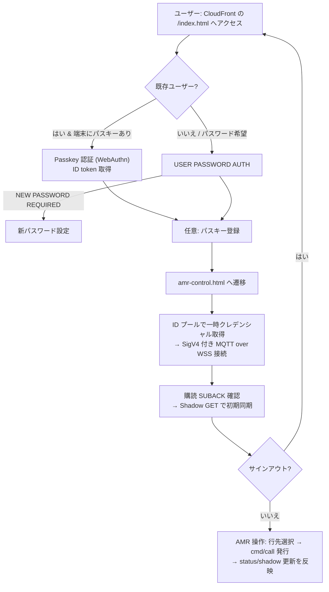

# SampleUI

本ディレクトリは **サンプル UI の実行に必要な最小一式** を集約します。  
アーキテクチャ仕様はリポジトリルートの **README.md** を、AWS 側の構築手順は **AWS_Console_Setup_Manual.md** を正（canonical）とします。  
本書では UI のデザインポリシー、配置、運用と確認フローを記載します。

- ブラウザ側（S3/CloudFront 配信）: `sample/s3/`
- 設備側 Thing（Raspberry Pi / Python）: `sample/thing/`

---

## 0. 前提

- リポジトリルートの **AWS_Console_Setup_Manual.md** に記載の手順どおり、インフラ（S3 + CloudFront + WAF、Cognito UserPool/IdentityPool、IoT Core など）が**生成済み**であること。
- 想定リージョンは **ap-northeast-1（東京）**。
- Cognito の UserPool に検証用ユーザー（例: `org-operator`）が存在し、**Passkey 登録**が行われていること。
- 本サンプルは **PoC 用の最小構成**。商用導入時は必ず **README.md / AWS_Console_Setup_Manual.md** のセキュリティ・運用要件に従ってください。

---

## 1. デザインポリシー（UI 共通・詳細）

本サンプル UI は **style.css** を全ページで共通読み込みし、**ページ固有の事情のみ**各 HTML 内 `<style>` で最小限に上書きします。

### 1.1 テーマ変数とタイポグラフィ
- **システムフォント**優先:  
  `system-ui, -apple-system, "Segoe UI", Roboto, "Noto Sans JP", "Hiragino Kaku Gothic ProN", "Meiryo", sans-serif`
- **カラートークン（CSS カスタムプロパティ）**:
  - ベース: `--bg`, `--panel`, `--text`, `--muted`, `--line`
  - ブランド: `--brand`, `--brand-2`, `--accent`
  - 状態: `--ok`, `--warn`, `--danger`
- **ライト/ダーク**: `prefers-color-scheme` に自動追従（トークンを切替）。
- **角丸・影**: `--radius`（既定 14px）, `--shadow`（ライト/ダークで強さ調整）。

### 1.2 リセット／ベース（reset.css は不要）
- 外部 `reset.css` は使わず、**軽量ノーマライズ**を `style.css` 冒頭に内包（`box-sizing: border-box`、フォームの `font: inherit`、画像の `max-width: 100%` など）。
- `a:hover` は下線表示、`hr` は薄い境界線で統一。

### 1.3 レイアウト（はみ出し防止と内部スクロール）
- `body` は画面いっぱい（`min-height: 100dvh`）だが**外側にスクロールを持たせない**。
- **.container をスクロール起点**とし、**.header は `position: sticky; top: 0;` で固定**。
- `.container` の幅は `min(1100px, 92%)`、中央寄せ。微小な最下段の“はみ出し”を避けるため `padding-bottom` を適用。
- 結果として「内容が短い画面はスクロールバー無し／長い画面は**中身だけ**がスクロール・ヘッダは残置」を実現。

### 1.4 共通コンポーネント
- **カード**: `.card`（角丸＋影＋1px ボーダー）。`.card-title`・`.card-subtitle` を併用。
- **フォーム**: `.row`（縦積みセクション）, `.inline`（横並びの行）, `.grow`（可変幅領域）
  - 入力: `.input`, `.select`（または要素セレクタで最低限の見栄えを付与済み）
  - フォーカス: `--brand` リング（`box-shadow` で 3px）
- **ボタン**:
  - 既定: `.btn`（グレー）
  - 主要動作: `.btn-primary`（`--brand` グラデーション）
  - 補助: `.btn-outline`（境界線のみ）
  - **互換**: 旧 HTML の `class="primary"` も `.btn-primary` と同等扱い（段階的に `.btn .btn-primary` へ移行）。
- **状態表示**: `.badge` + `.dot.(ok|warn|danger|idle)` を汎用表現に。**色だけに依らずテキストを併記**。

### 1.5 ブランド（badge.png）
- ヘッダ左の **`.brand-badge`** は既定ではグラデーション表示。  
  `sample/s3/assets/badge.png` を配置すると **背景画像**として自動で表示（`center/cover` でリサイズ）。
- **サインイン画面（index.html）**: 入力フォームの**中央上部**に `` を置き、**やや大きめ**に表示。
- 画像の **Content-Type は `image/png`**。更新は**版付きファイル名**で差し替え推奨。

### 1.6 セキュア配信とキャッシュ運用
- **CSP**: `script-src 'self'` / `style-src 'self'`。外部 CDN／フォントは不使用。ライブラリは `/vendor` に**自己ホスト**。
- **キャッシュ**: HTML は**0 秒**、CSS/JS/画像は**長期キャッシュ**＋**版付きファイル名**（例: `style.20250823.css`）。  
  反映は CloudFront の **無効化（`/*`）** で確実化。
- **id/name** は JS 実装（`signin.js`, `app.js`）が参照するため**変更しない**。  
  サインアウトボタンは `amr-control.html` のヘッダに **`id="logoutBtn"`** で**一本化**。

---

## 2. ディレクトリ構成（正）

```

sample/
├─ s3/                     # ブラウザ側（静的配信）
│  ├─ index.html           # サインイン画面（初回PW/以降パスキー）
│  ├─ signin.js            # 認証フロー制御（Passkey 登録含む）
│  ├─ amr-control.html     # 認証後の AMR 操作 UI
│  ├─ app.js               # IDプール→SigV4 WSS→MQTT 接続・購読・発行
│  ├─ config.js            # 公開識別子のみ（リージョン/Pools/Endpoint 等）
│  ├─ style.css            # 共通デザイン（本書のポリシーを実装）
│  ├─ vendor/              # 外部 UMD ライブラリ（自己ホスト）
│  │   ├─ aws-sdk-*.min.js
│  │   └─ paho-mqtt-*.min.js
│  └─ assets/
│      ├─ favicon.ico      # image/x-icon
│      └─ badge.png        # ブランドロゴ（ヘッダ小／サインイン上部大）
└─ thing/                  # 設備側（Raspberry Pi, Python）
    ├─ server.py
    ├─ requirements.txt
    └─ cert/               # ※ git非管理（RootCA/デバイス証明書/秘密鍵）

````

> **配置・CSP・キャッシュの詳細値**は、必ず **AWS_Console_Setup_Manual.md** を参照してください。

---

## 3. ブラウザ側セットアップ（S3 / CloudFront）

### 3.1 `config.js` の設定（公開識別子のみ）
- `region`: `"ap-northeast-1"`
- `userPoolId`: `ap-northeast-1_xxxxxxxx`
- `userPoolClientId`: `<APP_CLIENT_ID>`（Public）
- `identityPoolId`: `ap-northeast-1:xxxx-xxxx-xxxx-xxxx`
- `redirectUri`: `https://<CloudFrontドメイン>/index.html`
- `iotEndpoint`: `<xxx-ats.iot.ap-northeast-1.amazonaws.com>`
- `thingName`, `shadowName`: 環境に応じて設定

> **注意**: クライアントシークレット等の秘匿情報は**含めない**。

### 3.2 デプロイとキャッシュ更新
```bash
export BUCKET_NAME=my-iotgw-sample-site-bucket
aws s3 sync ./sample/s3 s3://$BUCKET_NAME/ --exclude ".DS_Store"

# 反映
aws cloudfront create-invalidation --distribution-id <DIST_ID> --paths "/*"
````

---

## 4. 設備側 Thing（Raspberry Pi / Python）

### 4.1 セットアップ

```bash
cd sample/thing
python3 -m venv venv
. venv/bin/activate
pip install -U pip
pip install -r requirements.txt
```

### 4.2 証明書配置（git 管理外）

* `sample/thing/certs/AmazonRootCA1.pem`
* `sample/thing/certs/device.pem.crt`
* `sample/thing/certs/private.pem.key`

#### 4.2.1 AmazonRootCA1.pem のダウンロード方法

**方法 A: curl / wget（Linux/macOS）**

```bash
# ダウンロード
curl -o sample/thing/certs/AmazonRootCA1.pem https://www.amazontrust.com/repository/AmazonRootCA1.pem
# もしくは
wget -O sample/thing/certs/AmazonRootCA1.pem https://www.amazontrust.com/repository/AmazonRootCA1.pem

# 検証（SHA-256 フィンガープリントを表示）
openssl x509 -in sample/thing/certs/AmazonRootCA1.pem -noout -fingerprint -sha256
```

**方法 B: PowerShell（Windows）**

```powershell
$dest = "sample/thing/certs/AmazonRootCA1.pem"
Invoke-WebRequest -Uri "https://www.amazontrust.com/repository/AmazonRootCA1.pem" -OutFile $dest

# 検証（OpenSSL があれば）
openssl x509 -in $dest -noout -fingerprint -sha256
```

> 取得先は **Amazon Trust Services の公式リポジトリ**です。ネットワークポリシー上ダウンロードが制限される場合は、オフラインで取得したうえで安全な手段で配布してください。

### 4.3 実行

* `server.py` の `IOT_ENDPOINT` / `THING_NAME` を自環境に合わせて設定。

```bash
python server.py
```

* 期待挙動: 接続成功 → 購読開始 → Heartbeat（10s） → 呼出しで `moving` → 5s 後に `idle`。

---

## 5. 画面遷移（Mermaid）



---

## 6. 動作確認フロー（UI 観点）

1. CloudFront URL（`/index.html`）にアクセスしサインイン

   * 初回: **メール＋パスワード** →（必要なら）**NEW\_PASSWORD\_REQUIRED** の処理。
   * 2回目以降: **Passkey（WebAuthn）**。
   * ログイン後、**パスキー登録**導線を提示（任意・推奨）。
2. `amr-control.html` に遷移

   * ヘッダ右上の**サインアウト**は `id="logoutBtn"` に統一。
   * `#conn-badge`（`.badge` + `.dot.*`）で接続状態を表示。
3. IoT Core 接続

   * ID プール → 一時クレデンシャル → SigV4 署名 URL → WSS 接続。
   * **SUBACK 確認後に Shadow GET** を送信し、初期状態と整合。
4. AMR 呼出し

   * 行先セレクト `#dest`、呼出し `#callBtn`（主要動作は `.btn-primary`）
   * ステータス `#status` / `#hbInfo` に反映（色だけに依存しない）。

---

## 7. セキュリティ／配信の要点（抜粋）

* `config.js` は**公開識別子のみ**。クライアントシークレットは絶対に含めない。
* Identity Pool ロール／IoT ポリシーは**最小権限**（publish/subscribe のトピック範囲を限定）。
* S3 は **Block Public Access + OAC**、CloudFront は **CSP + WAF** を適用。
* HTML は 0 秒キャッシュ、CSS/JS/画像は長期キャッシュ＋**版付き**（更新時は CloudFront 無効化）。

---

## 8. 運用チェックリスト

* [ ] `sample/s3` に HTML/CSS/JS/vendor/assets を配置
* [ ] `assets/badge.png` の Content-Type が `image/png`
* [ ] CloudFront の CSP（`script-src 'self'`, `style-src 'self'`）が適用
* [ ] HTML=0秒／CSS・JS・画像=長期キャッシュ＋版付き運用
* [ ] 反映時に CloudFront **無効化（`/*`）** を実行
* [ ] Cognito AppClient が Public で `ALLOW_USER_AUTH` + `ALLOW_USER_PASSWORD_AUTH` 有効
* [ ] IoT ポリシー（publish/subscribe/Shadow）が最小権限で一致

---

## 9. 将来の改修方針

* 変更は **役割単位**（UI／認証／MQTT）で実施し、対象ファイルは**全文置換**で生成する。
* デザイン改修はまず **style.css のトークン／コンポーネント**を更新し、ページ固有 `<style>` は最小限。
* 互換の `.primary` は段階的に **`.btn .btn-primary`** へ移行。
* 画像・アセットは `assets/` に集約し、**長期キャッシュ＋版付き**で運用。

